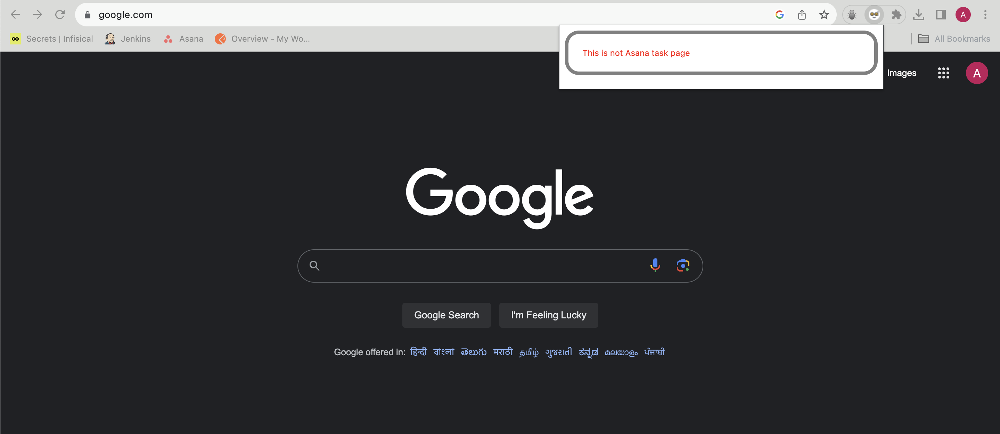

# Asana DSM Generator

Chrome extension to generate DSM for tasks scheduled for today and tomorrow.

## Description

My motivation for this project stems from the daily task of updating the DSM at the end of the day, listing the tasks completed today and those scheduled for tomorrow. The manual process of copying each task individually and posting it in the Slack channel of the corresponding project is quite cumbersome.

Directly copy and paste DSM in your preferred text editor or software application

Open any asana project in the browser and click on **Copy DSM**, script will take url from browser url and fetch relavant data of this project. To fetch other project details, just change project in asana and click **Copy DSM** that's it, DSM will be copied.

  

## Getting Started

### Dependencies

- [asana access token](https://developers.asana.com/docs/personal-access-token)
- Email id used in asana

### Installing

This is a chrome extension. To install in [development mode](https://developer.chrome.com/docs/extensions/mv3/getstarted/extensions-101/#debugging)

## Authors

Contributors names and contact info

- Atir Nayab
- Rohit Singh (Verbal)

## Version History

- 1.0.0
  - Get DSM per asana project.
- 1.1.0
  - Dropped support for markdown syntax
  - Added HTML and Plain text support for DSM

## License

This project is licensed under the MIT License - see the LICENSE.md file for details

## Acknowledgments

- [Build a Chrome Extension – Course for Beginners](https://www.youtube.com/watch?v=0n809nd4Zu4&t=436s&ab_channel=freeCodeCamp.org)
- [Extensions](https://developer.chrome.com/docs/extensions/)
